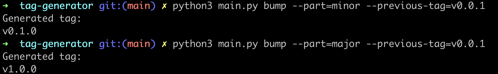

# Tag Generator

I wrote this program originally to create a SemVer tag in an easy way.

## Prerequisites

1) Python 3.10
2) pip3
    - Install the necessary packages by running `pip3 install -r requirements.txt`

## How to Use

Run `python3 main.py -h` for help.

## Screenshots

### Help Menu

### Create Tag

### Bump Tag

